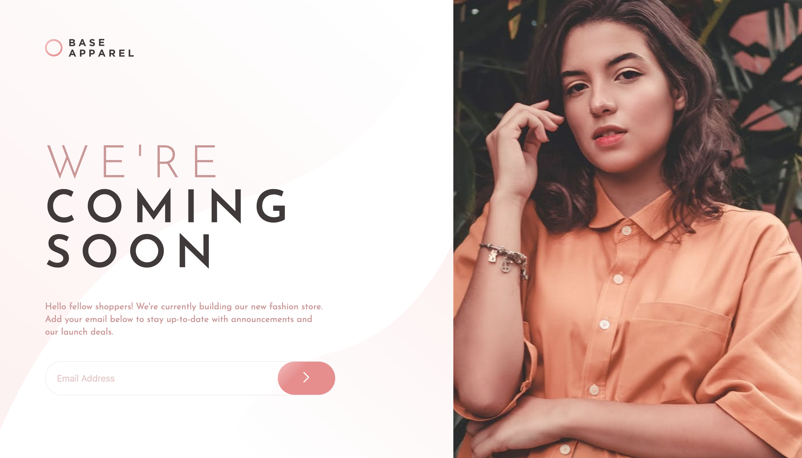

# Frontend Mentor - Base Apparel coming soon page solution

This is a solution to the [Base Apparel coming soon page challenge on Frontend Mentor](https://www.frontendmentor.io/challenges/base-apparel-coming-soon-page-5d46b47f8db8a7063f9331a0). Frontend Mentor challenges help you improve your coding skills by building realistic projects. 


## Table of contents

- [Overview](#overview)
  - [The challenge](#the-challenge)
  - [Screenshot](#screenshot)
  - [Links](#links)
- [My process](#my-process)
  - [Built with](#built-with)
  - [What I learned](#what-i-learned)
  - [Continued development](#continued-development)
  - [Useful resources](#useful-resources)
- [Author](#author)
- [Acknowledgments](#acknowledgments)


## Overview

### The challenge

Users should be able to:

- View the optimal layout for the site depending on their device's screen size
- See hover states for all interactive elements on the page
- Receive an error message when the `form` is submitted if:
  - The `input` field is empty
  - The email address is not formatted correctly
- Recieve a success message when the email address submitted is valid  

### Screenshot




### Links

- Solution URL: [Add solution URL here](https://your-solution-url.com)
- Live Site URL: [Add live site URL here](https://your-live-site-url.com)

## My process

### Built with

- Semantic HTML5 markup
- Flexbox
- CSS Grid
- Vanilla JavaScript


### What I learned

One of the main elements I learned and implemented was CSS Grid for the main layout and Flexbox some instances. It was important learned something new and put that to practice to continue my learning journey.

In addition, I implemented regular experession with JavaScript to validate the email address. 

Use this section to recap over some of your major learnings while working through this project. Writing these out and providing code samples of areas you want to highlight is a great way to reinforce your own knowledge.

See code snippets below:


```css
.formpg {
  display: grid;
  grid-template-columns: 1.3fr 1fr;
  grid-auto-rows: auto;
  grid-gap: 0;
}
```
```js
function emailIsValid (email) {
    return /\S+@\S+\.\S+/.test(email);
}
```


### Continued development

Going foward I would like to explore more Javascript heavy projects to work on designing the logic to solve the problem, as well as exploring advanced CSS with Flex box and animations. 


### Useful resources

- [W3 Schools](https://www.w3schools.com/) - This helped me with the Javascript syntax for the different code blocks.
- [CSS matic](https://www.cssmatic.com/box-shadow) - This is an amazing tool to test and create boxshodows.


## Author

- Frontend Mentor - [@ahmedadams](https://www.frontendmentor.io/profile/ahmedadams)
- Twitter - [@adam8create](https://twitter.com/adam8create)


## Acknowledgments

I would like to say thank you to Frontend Mentor, it an amazing platform and it so needed is unbelievable. Knowing what projects to fine tune your skills as an aspiring developer is not easy and this makes the journey that much more fun! Thank you!   


